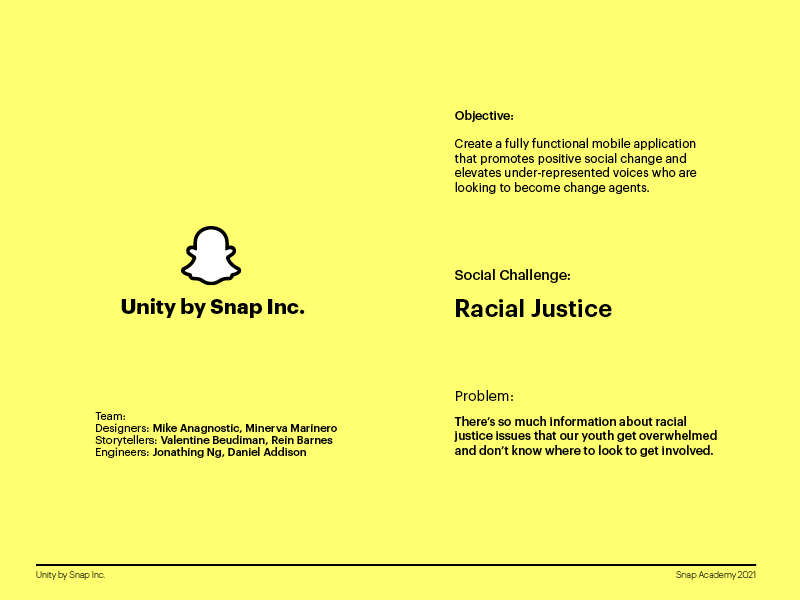
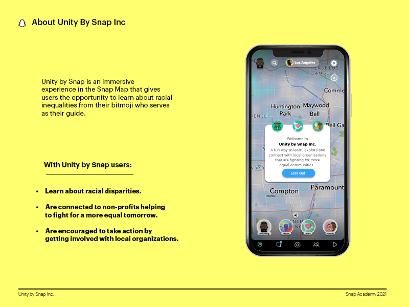
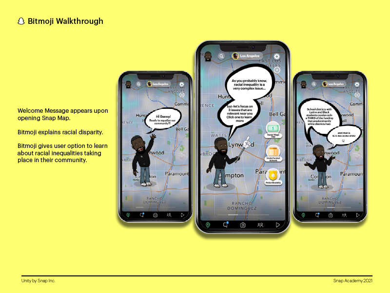
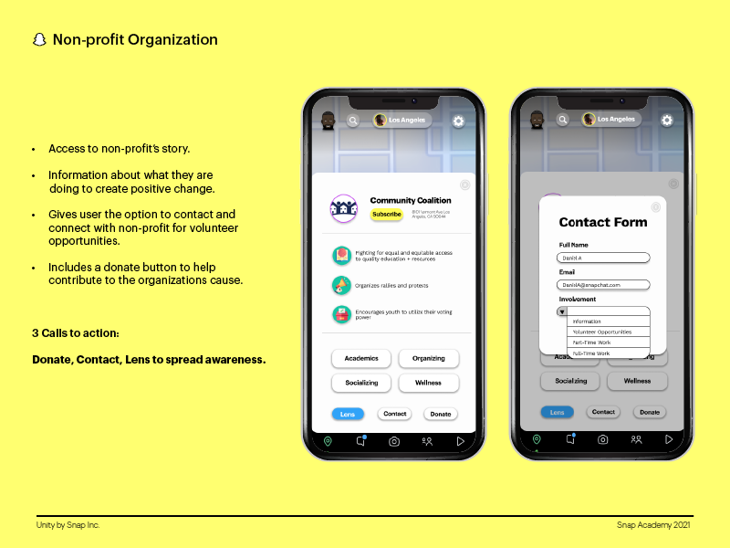
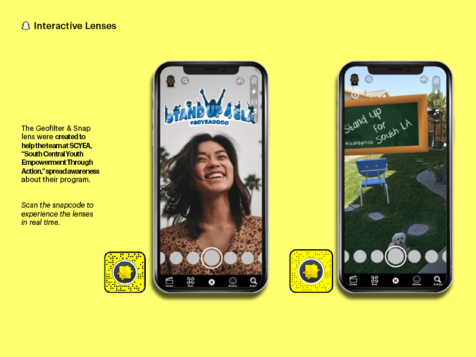

# Unity by Snap

This application is a design-focused prototype of "Unity by Snap", a Snapchat feature I pitched to Snap's Chief Communication Officer, Julie Henderson. Unity is focused on educating users on racial injustices and connecting them to non-profit organizations that can help them make a difference.

## Short Demo
Link: https://youtu.be/MHExwnvIKV4

## 5 Minute Pitch
Link: https://youtu.be/7l0tOqPzJ0E

## App Experience

~ | Welcome | Educate | Connect
:-------------------------:|:-------------------------:|:-------------------------:|:-------------------------:
**Samples** |  |  | 

## Fun Technical Aspects

~ | Maps API | Organization Bio Slide Up <br/> (and map movement)
:-------------------------:|:-------------------------:|:-------------------------:
**Samples** |  | 

## To Run

1. In terminal, run: 
```
npm install
```
2. Next, run:
```
expo r -c
```
3. After a moment, a webpage should open on your default brower with a QR Code.
4. Download Expo Go application on your mobile device (https://expo.dev/client).
5. On your mobile device's native camera application, scan the QR code. You should be directed to Expo Go.
6. Once it loads, you're in!
7. Login with 
<br>&nbsp;&nbsp;&nbsp;&nbsp;&nbsp;&nbsp;Username: jon@gmail.com <em>(This isn't my actual email! Email me at jonathanchongng@gmail.com :smile:)</em><br>
&nbsp;&nbsp;&nbsp;&nbsp;&nbsp;&nbsp;Password: abcdef
8. Press the leftmost tab, Snap Map.
9. Explore! If ever unsure about how to proceed, tap anywhere.

## Tools Used

1. React Native (https://reactnative.dev/)
2. Expo (https://expo.dev/)
3. React Native Maps (https://github.com/react-native-maps/react-native-maps)
4. React Native Gesture Handler (https://docs.swmansion.com/react-native-gesture-handler/)
5. React Native Reanimated (https://docs.swmansion.com/react-native-reanimated/)
6. React Navigation (https://reactnavigation.org/)
7. React Native Gifted Chat (https://github.com/FaridSafi/react-native-gifted-chat)
8. Google Firebase Firestore (https://firebase.google.com/docs/firestore)
9. Google Firebase Authentication (https://firebase.google.com/docs/auth)

## Additional Slides







